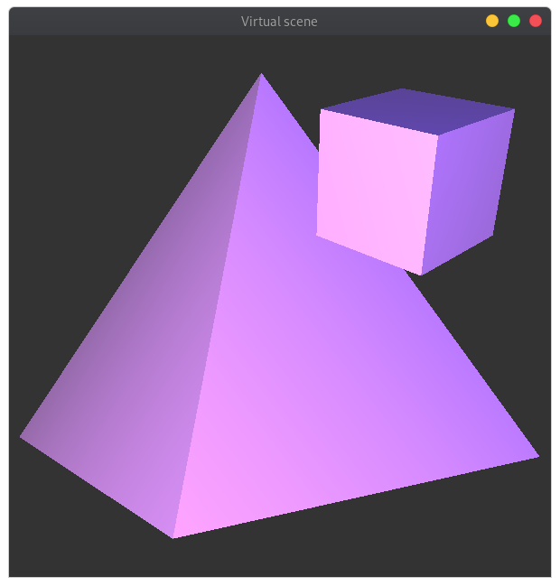

# virtual-scene

Приложение, генерирующее виртуальную сцену с камерой, кубом и пирамидой (тестовое задание).

## Сборка

### Локальная сборка

```
cmake CMakeLists.txt
make
```

### Docker

Сборка контейнера с использованием `Dockerfile`. Пример:

```
docker build -t virtualscene .
docker run --network host -e DISPLAY=$DISPLAY virtualscene <parameters...>
```

## Использование

Координаты объектов и другие параметры задаются в виде параметров программы.

```
./virtual-scene camX camY camZ
                cubeX cubeY cubeZ 
                cubeScale cubeRotX cubeRotY
                pyramidX pyramidY pyramidZ 
                pyramidScale pyramidRotX pyramidRotY
```

- `camX`, `camY`, `camZ` — координаты камеры
- `cubeX`, `cubeY`, `cubeZ` — координаты куба
- `pyramidX`, `pyramidY`, `pyramidZ` — координаты пирамиды
- `cubeScale`, `pyramidScale` — размеры куба и пирамиды
- `cubeRotX`, `cubeRotY`, `pyramidRotX`, `pyramidRotY` — углы вращения куба и пирамиды вокруг осей `X` и `Y` соответственно в градусах

Камеру в приложении можно двигать с помощью стрелок или клавиш `W`/`A`/`S`/`D`/`Q`/`E`.

## Пример

```
> ./virtual-scene 0.0 0.0 4.0     \                          
                  1.0 1.0 -1.0    \
                  0.5 30.0 45.0   \
                  -0.2 0.5 -3.0   \
                  2.0 0.0 35.0
```

